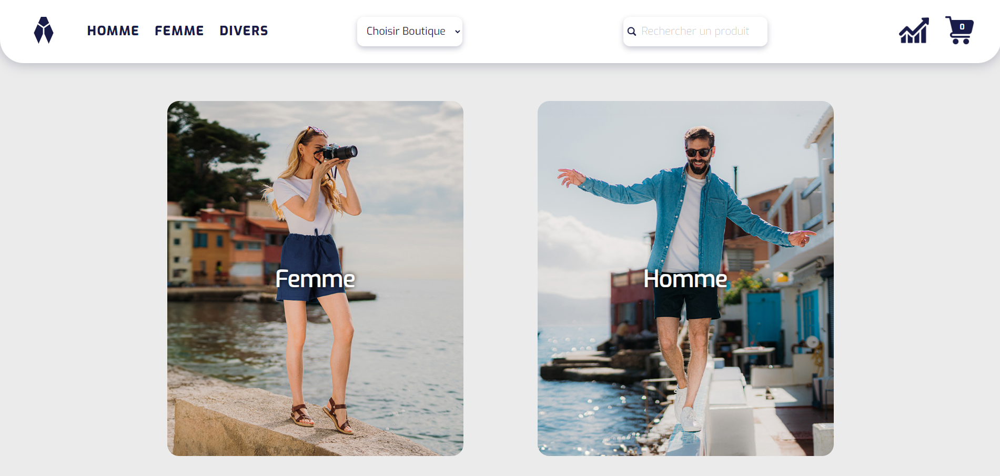
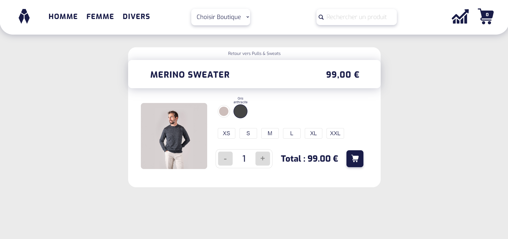
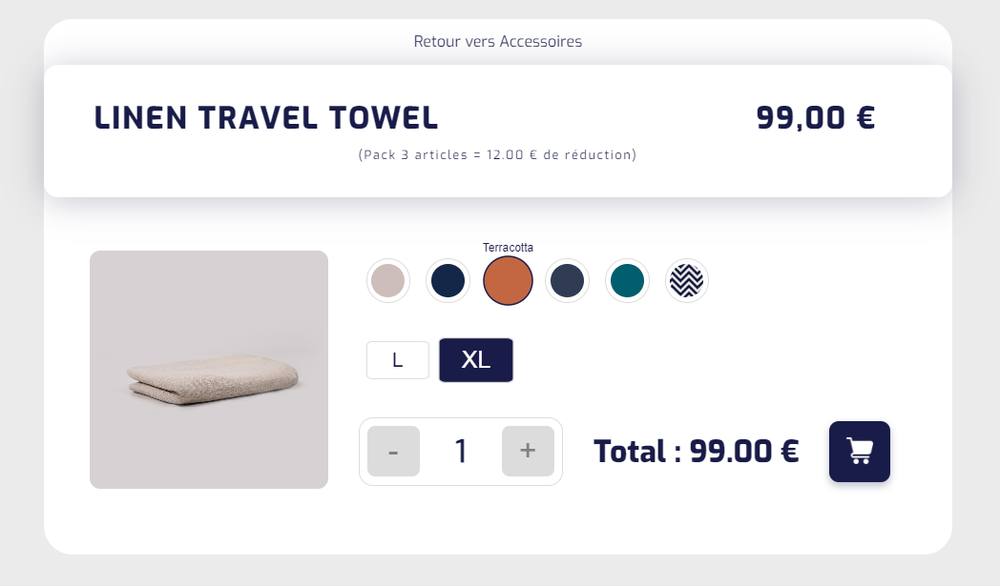
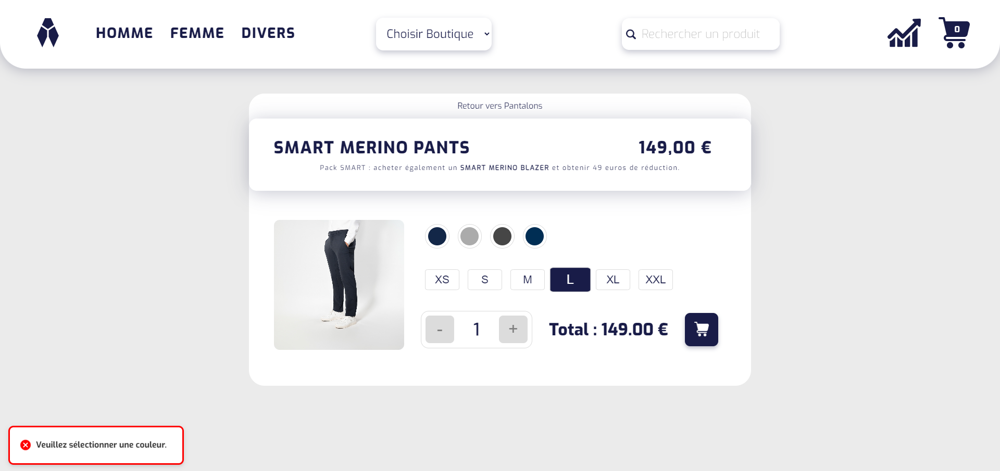
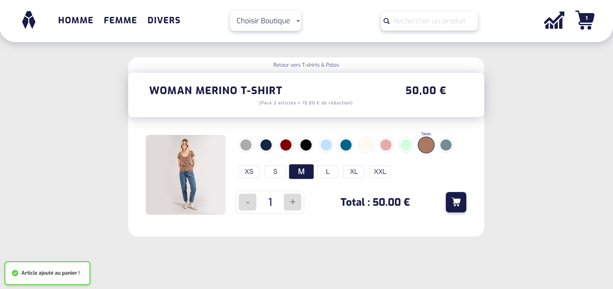
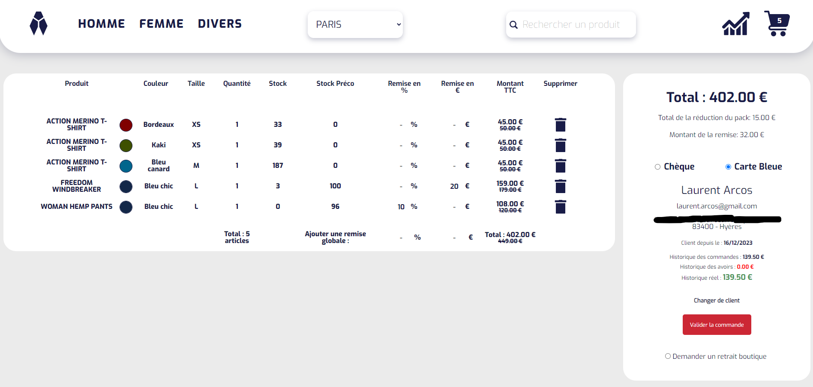
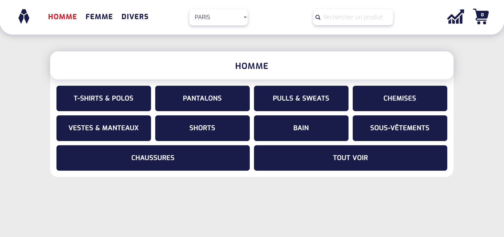
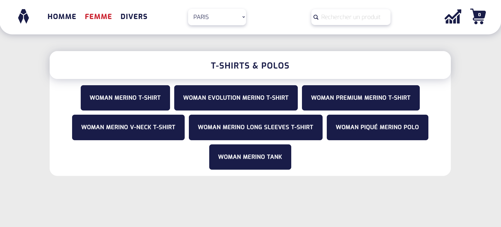
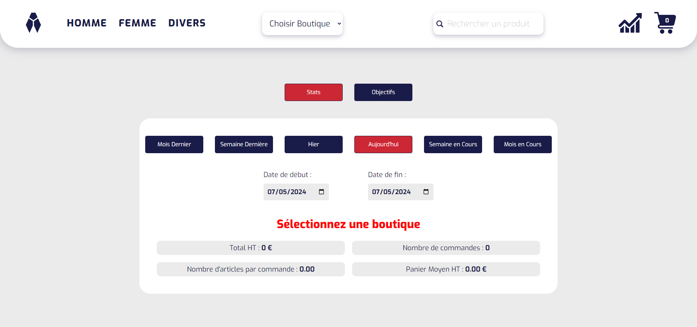
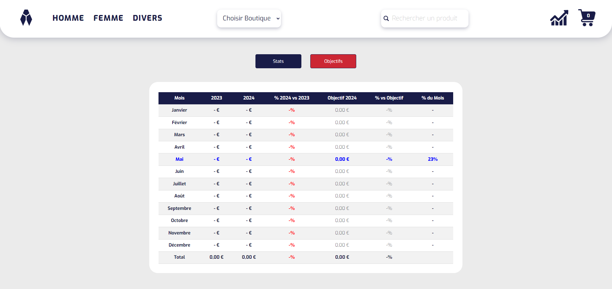

# Cigale-POS-App

Bienvenue sur la page de présentation de l'application utilisée dans les boutiques [Seagale](https://seagale.fr). Ce dépôt **Cigale-POS-App** sert de vitrine pour le résultat final de l'application que j'ai développée et dont le code source est hébergé dans un dépôt privé (**Seagale-POS-App**) en raison des politiques de propriété intellectuelle de l'entreprise.

## Technologie et expertise
Le projet **Seagale-POS-App** a été développé en utilisant l'API de PrestaShop pour gérer dynamiquement le contenu e-commerce. L'application cliente est construite avec React, exploitant React Router pour une navigation fluide et sans rechargement. Pour un développement rapide et efficace, j'utilise également Vite comme outil de build moderne qui offre des temps de rechargement extrêmement rapides et une configuration simplifiée. Le style de l'application est géré par Sass, permettant une écriture plus claire et plus structurée des feuilles de style CSS. Côté serveur, j'utilise Express pour orchestrer les requêtes et les réponses HTTP, assurant ainsi une intégration efficace avec l'API de PrestaShop. De plus, j'ai écrit des scripts personnalisés en PHP pour une gestion optimale des interactions avec l'API PrestaShop et pour effectuer des appels personnalisés à la base de données, permettant ainsi des opérations complexes de réception et d'envoi de données.

## À propos de Seagale-POS-App
**Seagale-POS-App** est une solution point de vente (POS) conçue pour augmenter l'efficacité opérationnelle des magasins de la marque grâce à une interface intuitive et des fonctionnalités avancées. L'application est entièrement responsive, permettant aux vendeurs de l'utiliser sur ordinateurs, smartphones, et tablettes.

## Aperçu du projet
Ci-dessous, vous trouverez des captures d'écran illustrant diverses fonctionnalités de l'application, mettant en lumière l'interface utilisateur conçue pour optimiser l'expérience utilisateur (les vendeurs en boutique).

### Page d'accueil

### Page de produit

### Détail de la page produit

### Sélection de couleur

### Ajout au panier

### Panier

### Menu des catégories

### Menu des produits

### Statistiques

### Objectifs

## Contact
Pour plus d'informations ou pour demander l'accès au dépôt privé, n'hésitez pas à me contacter via [laurent.arcos@gmail.com](mailto:laurent.arcos@gmail.com).
